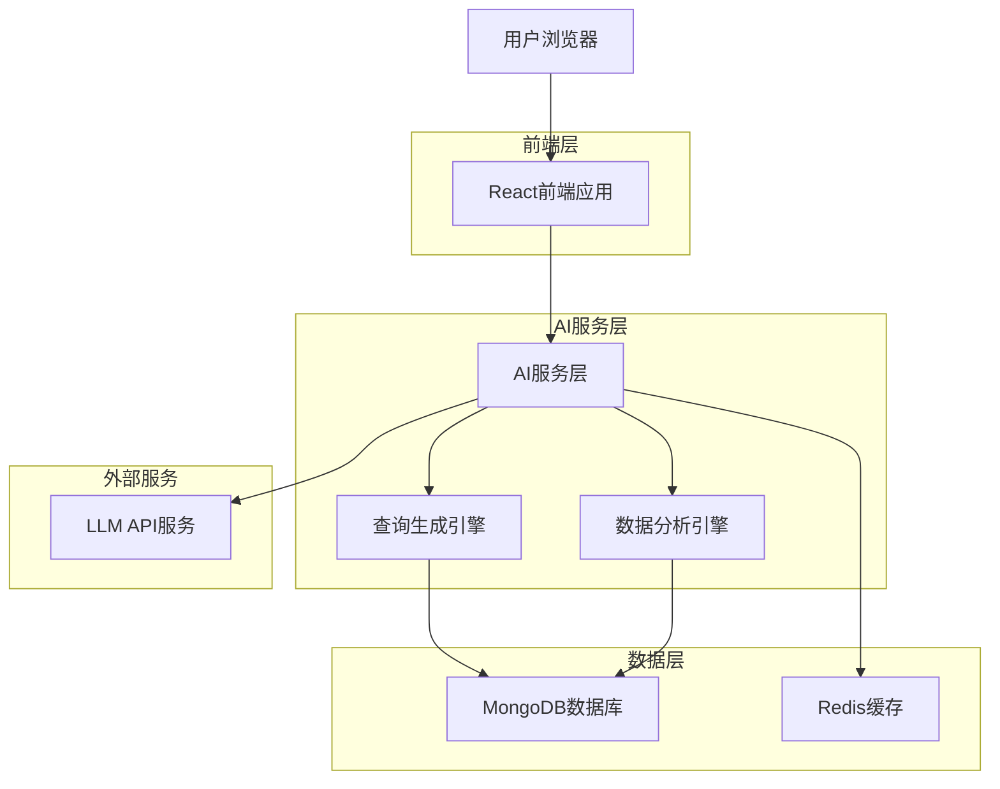
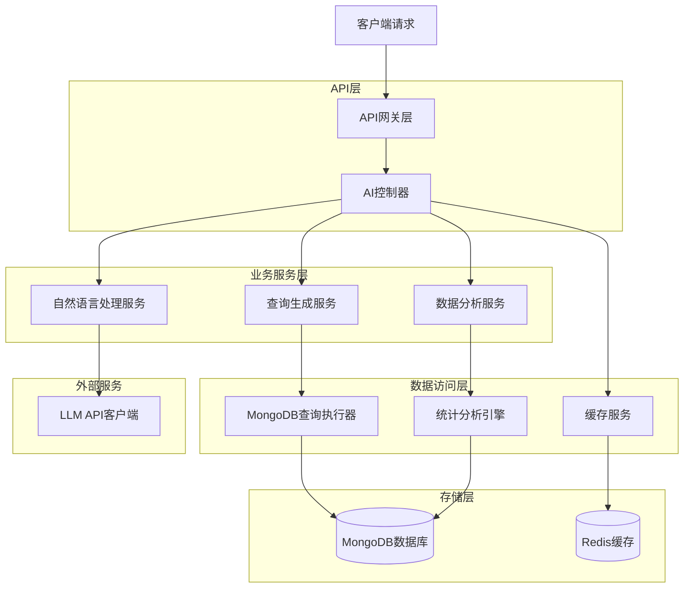
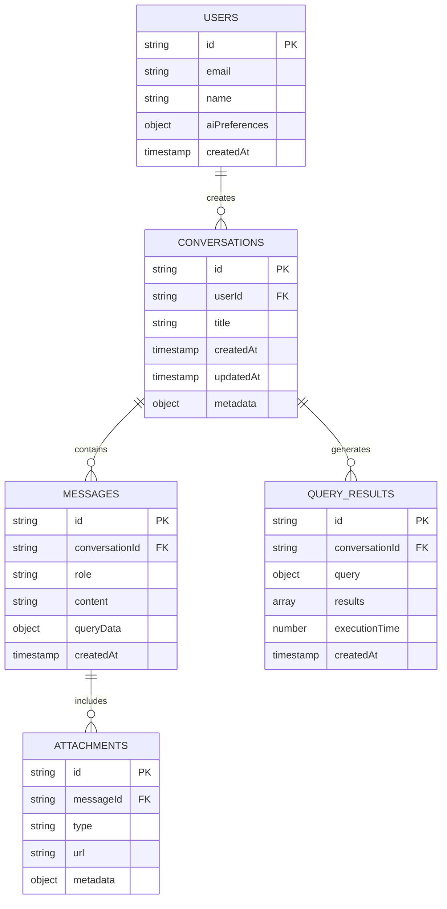

# MongoDB可视化工具AI功能技术架构文档

## 1. 架构设计



## 2. 技术描述

- 前端：React@18 + TypeScript + Tailwind CSS + Zustand
- 后端：Node.js + Express + TypeScript
- AI集成：OpenAI GPT-4 API / Anthropic Claude API
- 数据库：MongoDB + Redis（缓存）
- 部署：Docker + Docker Compose

## 3. 路由定义

| 路由 | 用途 |
|------|------|
| /ai-chat | AI对话主界面，提供智能查询和数据分析功能 |
| /ai-insights | AI数据洞察页面，展示自动生成的数据分析报告 |
| /ai-history | AI对话历史管理，查看和管理历史对话记录 |
| /ai-settings | AI功能设置，配置模型参数和用户偏好 |

## 4. API定义

### 4.1 AI对话API

**AI聊天接口**
```
POST /api/ai/chat
```

请求参数：
| 参数名 | 参数类型 | 是否必需 | 描述 |
|--------|----------|----------|------|
| message | string | true | 用户输入的自然语言消息 |
| conversationId | string | false | 对话ID，用于维护上下文 |
| databaseSchema | object | false | 当前数据库结构信息 |
| context | object | false | 对话上下文信息 |

响应参数：
| 参数名 | 参数类型 | 描述 |
|--------|----------|------|
| response | string | AI的回复消息 |
| query | object | 生成的MongoDB查询语句 |
| results | array | 查询执行结果 |
| conversationId | string | 对话ID |
| suggestions | array | 相关建议和后续操作 |

示例：
```json
{
  "message": "显示所有年龄大于25岁的用户",
  "conversationId": "conv_123",
  "databaseSchema": {
    "collections": ["users", "orders", "products"]
  }
}
```

**智能查询生成**
```
POST /api/ai/generate-query
```

请求参数：
| 参数名 | 参数类型 | 是否必需 | 描述 |
|--------|----------|----------|------|
| description | string | true | 查询需求的自然语言描述 |
| collection | string | true | 目标集合名称 |
| schema | object | false | 集合的字段结构信息 |

响应参数：
| 参数名 | 参数类型 | 描述 |
|--------|----------|------|
| query | object | 生成的MongoDB查询对象 |
| explanation | string | 查询逻辑的解释说明 |
| estimatedCount | number | 预估结果数量 |

**数据分析请求**
```
POST /api/ai/analyze
```

请求参数：
| 参数名 | 参数类型 | 是否必需 | 描述 |
|--------|----------|----------|------|
| data | array | true | 需要分析的数据集 |
| analysisType | string | true | 分析类型（统计、趋势、分布等） |
| options | object | false | 分析选项和参数 |

响应参数：
| 参数名 | 参数类型 | 描述 |
|--------|----------|------|
| insights | array | 数据洞察和发现 |
| charts | array | 推荐的图表配置 |
| summary | string | 分析结果摘要 |
| recommendations | array | 基于分析的建议 |

### 4.2 对话历史API

**获取对话历史**
```
GET /api/ai/conversations
```

**保存对话记录**
```
POST /api/ai/conversations
```

**删除对话**
```
DELETE /api/ai/conversations/:id
```

## 5. 服务器架构图



## 6. 数据模型

### 6.1 数据模型定义



### 6.2 数据定义语言

**对话表 (conversations)**
```sql
-- 创建对话表
CREATE TABLE conversations (
    id UUID PRIMARY KEY DEFAULT gen_random_uuid(),
    user_id UUID NOT NULL,
    title VARCHAR(255) NOT NULL,
    created_at TIMESTAMP WITH TIME ZONE DEFAULT NOW(),
    updated_at TIMESTAMP WITH TIME ZONE DEFAULT NOW(),
    metadata JSONB DEFAULT '{}'
);

-- 创建索引
CREATE INDEX idx_conversations_user_id ON conversations(user_id);
CREATE INDEX idx_conversations_created_at ON conversations(created_at DESC);

-- 初始化数据
INSERT INTO conversations (user_id, title, metadata) VALUES
('user_123', '数据查询对话', '{"tags": ["query"], "language": "zh"}'),
('user_123', '统计分析对话', '{"tags": ["analysis"], "language": "zh"}');
```

**消息表 (messages)**
```sql
-- 创建消息表
CREATE TABLE messages (
    id UUID PRIMARY KEY DEFAULT gen_random_uuid(),
    conversation_id UUID NOT NULL REFERENCES conversations(id),
    role VARCHAR(20) NOT NULL CHECK (role IN ('user', 'assistant', 'system')),
    content TEXT NOT NULL,
    query_data JSONB,
    created_at TIMESTAMP WITH TIME ZONE DEFAULT NOW()
);

-- 创建索引
CREATE INDEX idx_messages_conversation_id ON messages(conversation_id);
CREATE INDEX idx_messages_created_at ON messages(created_at DESC);
```

**查询结果表 (query_results)**
```sql
-- 创建查询结果表
CREATE TABLE query_results (
    id UUID PRIMARY KEY DEFAULT gen_random_uuid(),
    conversation_id UUID NOT NULL REFERENCES conversations(id),
    query JSONB NOT NULL,
    results JSONB NOT NULL,
    execution_time INTEGER DEFAULT 0,
    created_at TIMESTAMP WITH TIME ZONE DEFAULT NOW()
);

-- 创建索引
CREATE INDEX idx_query_results_conversation_id ON query_results(conversation_id);
CREATE INDEX idx_query_results_execution_time ON query_results(execution_time);
```

**AI配置表 (ai_configurations)**
```sql
-- 创建AI配置表
CREATE TABLE ai_configurations (
    id UUID PRIMARY KEY DEFAULT gen_random_uuid(),
    user_id UUID NOT NULL,
    model_name VARCHAR(100) NOT NULL,
    api_key_encrypted TEXT,
    preferences JSONB DEFAULT '{}',
    created_at TIMESTAMP WITH TIME ZONE DEFAULT NOW(),
    updated_at TIMESTAMP WITH TIME ZONE DEFAULT NOW()
);

-- 创建索引
CREATE INDEX idx_ai_configurations_user_id ON ai_configurations(user_id);
```

## 7. AI服务实现

### 7.1 自然语言处理服务

```typescript
// AI服务接口定义
interface AIService {
  processMessage(message: string, context: ConversationContext): Promise<AIResponse>;
  generateQuery(description: string, schema: DatabaseSchema): Promise<QueryResult>;
  analyzeData(data: any[], analysisType: string): Promise<AnalysisResult>;
}

// OpenAI服务实现
class OpenAIService implements AIService {
  private client: OpenAI;
  
  constructor(apiKey: string) {
    this.client = new OpenAI({ apiKey });
  }
  
  async processMessage(message: string, context: ConversationContext): Promise<AIResponse> {
    const systemPrompt = this.buildSystemPrompt(context.databaseSchema);
    const messages = this.buildMessageHistory(context.history, message);
    
    const response = await this.client.chat.completions.create({
      model: 'gpt-4',
      messages: [{ role: 'system', content: systemPrompt }, ...messages],
      temperature: 0.1,
      max_tokens: 2000
    });
    
    return this.parseAIResponse(response.choices[0].message.content);
  }
  
  private buildSystemPrompt(schema: DatabaseSchema): string {
    return `你是一个MongoDB数据库查询助手。
    数据库结构：${JSON.stringify(schema)}
    请根据用户的自然语言描述生成相应的MongoDB查询语句。
    回复格式：JSON对象，包含query、explanation、suggestions字段。`;
  }
}
```

### 7.2 查询生成引擎

```typescript
// 查询生成器
class QueryGenerator {
  async generateMongoQuery(description: string, collection: string, schema: any): Promise<any> {
    // 使用AI生成基础查询
    const aiQuery = await this.aiService.generateQuery(description, schema);
    
    // 验证和优化查询
    const validatedQuery = this.validateQuery(aiQuery);
    const optimizedQuery = this.optimizeQuery(validatedQuery, schema);
    
    return {
      query: optimizedQuery,
      explanation: aiQuery.explanation,
      estimatedPerformance: this.estimatePerformance(optimizedQuery)
    };
  }
  
  private validateQuery(query: any): any {
    // 安全检查：禁止删除、更新操作
    const dangerousOps = ['$unset', '$set', '$remove'];
    const queryStr = JSON.stringify(query);
    
    for (const op of dangerousOps) {
      if (queryStr.includes(op)) {
        throw new Error(`不允许的操作：${op}`);
      }
    }
    
    return query;
  }
  
  private optimizeQuery(query: any, schema: any): any {
    // 添加索引提示
    // 优化聚合管道
    // 限制返回字段
    return query;
  }
}
```

### 7.3 数据分析引擎

```typescript
// 数据分析服务
class DataAnalysisService {
  async analyzeDataset(data: any[], analysisType: string): Promise<AnalysisResult> {
    switch (analysisType) {
      case 'descriptive':
        return this.descriptiveAnalysis(data);
      case 'trend':
        return this.trendAnalysis(data);
      case 'distribution':
        return this.distributionAnalysis(data);
      default:
        return this.autoAnalysis(data);
    }
  }
  
  private descriptiveAnalysis(data: any[]): AnalysisResult {
    const numericFields = this.getNumericFields(data);
    const statistics = {};
    
    for (const field of numericFields) {
      const values = data.map(item => item[field]).filter(v => typeof v === 'number');
      statistics[field] = {
        count: values.length,
        mean: this.calculateMean(values),
        median: this.calculateMedian(values),
        std: this.calculateStandardDeviation(values),
        min: Math.min(...values),
        max: Math.max(...values)
      };
    }
    
    return {
      type: 'descriptive',
      statistics,
      insights: this.generateInsights(statistics),
      charts: this.recommendCharts(statistics)
    };
  }
  
  private async autoAnalysis(data: any[]): Promise<AnalysisResult> {
    // 使用AI自动选择分析方法
    const dataProfile = this.profileData(data);
    const analysisPrompt = `分析以下数据特征，推荐合适的分析方法：${JSON.stringify(dataProfile)}`;
    
    const aiRecommendation = await this.aiService.processMessage(analysisPrompt, {});
    
    // 根据AI建议执行相应分析
    return this.executeRecommendedAnalysis(data, aiRecommendation);
  }
}
```

## 8. 前端组件架构

### 8.1 AI聊天组件

```typescript
// AI聊天主组件
interface AIChatProps {
  conversationId?: string;
  onQueryGenerated?: (query: any) => void;
}

const AIChat: React.FC<AIChatProps> = ({ conversationId, onQueryGenerated }) => {
  const [messages, setMessages] = useState<Message[]>([]);
  const [inputValue, setInputValue] = useState('');
  const [isLoading, setIsLoading] = useState(false);
  
  const sendMessage = async (content: string) => {
    setIsLoading(true);
    
    try {
      const response = await aiService.chat({
        message: content,
        conversationId,
        context: { databaseSchema: getCurrentSchema() }
      });
      
      setMessages(prev => [
        ...prev,
        { role: 'user', content },
        { role: 'assistant', content: response.response, queryData: response.query }
      ]);
      
      if (response.query && onQueryGenerated) {
        onQueryGenerated(response.query);
      }
    } catch (error) {
      console.error('AI聊天错误:', error);
    } finally {
      setIsLoading(false);
    }
  };
  
  return (
    <div className="ai-chat-container">
      <MessageList messages={messages} />
      <ChatInput 
        value={inputValue}
        onChange={setInputValue}
        onSend={sendMessage}
        isLoading={isLoading}
      />
    </div>
  );
};
```

### 8.2 智能查询构建器

```typescript
// 智能查询构建器组件
const SmartQueryBuilder: React.FC = () => {
  const [naturalLanguage, setNaturalLanguage] = useState('');
  const [generatedQuery, setGeneratedQuery] = useState<any>(null);
  const [isGenerating, setIsGenerating] = useState(false);
  
  const generateQuery = async () => {
    setIsGenerating(true);
    
    try {
      const result = await aiService.generateQuery({
        description: naturalLanguage,
        collection: getCurrentCollection(),
        schema: getCurrentSchema()
      });
      
      setGeneratedQuery(result);
    } catch (error) {
      console.error('查询生成错误:', error);
    } finally {
      setIsGenerating(false);
    }
  };
  
  return (
    <div className="smart-query-builder">
      <textarea
        value={naturalLanguage}
        onChange={(e) => setNaturalLanguage(e.target.value)}
        placeholder="用自然语言描述你想要的查询..."
        className="w-full p-3 border rounded-lg"
      />
      
      <button
        onClick={generateQuery}
        disabled={isGenerating || !naturalLanguage.trim()}
        className="mt-2 px-4 py-2 bg-blue-500 text-white rounded-lg"
      >
        {isGenerating ? '生成中...' : '生成查询'}
      </button>
      
      {generatedQuery && (
        <QueryPreview 
          query={generatedQuery.query}
          explanation={generatedQuery.explanation}
          onExecute={() => executeQuery(generatedQuery.query)}
        />
      )}
    </div>
  );
};
```

### 8.3 数据洞察组件

```typescript
// 数据洞察展示组件
const DataInsights: React.FC<{ data: any[] }> = ({ data }) => {
  const [insights, setInsights] = useState<AnalysisResult | null>(null);
  const [isAnalyzing, setIsAnalyzing] = useState(false);
  
  useEffect(() => {
    if (data.length > 0) {
      analyzeData();
    }
  }, [data]);
  
  const analyzeData = async () => {
    setIsAnalyzing(true);
    
    try {
      const result = await aiService.analyzeData({
        data,
        analysisType: 'auto'
      });
      
      setInsights(result);
    } catch (error) {
      console.error('数据分析错误:', error);
    } finally {
      setIsAnalyzing(false);
    }
  };
  
  if (isAnalyzing) {
    return <div className="loading-spinner">正在分析数据...</div>;
  }
  
  if (!insights) {
    return null;
  }
  
  return (
    <div className="data-insights">
      <h3 className="text-lg font-semibold mb-4">数据洞察</h3>
      
      <div className="insights-grid">
        {insights.insights.map((insight, index) => (
          <InsightCard key={index} insight={insight} />
        ))}
      </div>
      
      {insights.charts && (
        <div className="charts-section mt-6">
          <h4 className="text-md font-medium mb-3">推荐图表</h4>
          <ChartRecommendations charts={insights.charts} data={data} />
        </div>
      )}
    </div>
  );
};
```

## 9. 部署和配置

### 9.1 环境变量配置

```bash
# AI服务配置
OPENAI_API_KEY=your_openai_api_key
ANTHROPIC_API_KEY=your_anthropic_api_key
AI_MODEL_PROVIDER=openai  # openai | anthropic | local
AI_MODEL_NAME=gpt-4

# Redis配置（用于缓存）
REDIS_URL=redis://localhost:6379
REDIS_PASSWORD=your_redis_password

# AI功能开关
ENABLE_AI_FEATURES=true
AI_RATE_LIMIT=100  # 每小时请求限制
AI_TIMEOUT=30000   # 超时时间（毫秒）

# 安全配置
AI_QUERY_WHITELIST=find,aggregate,count
AI_MAX_RESULT_SIZE=1000
```

### 9.2 Docker配置更新

```dockerfile
# 更新后端Dockerfile
FROM node:18-alpine

WORKDIR /app

# 安装AI相关依赖
COPY package*.json ./
RUN npm install

# 复制源码
COPY . .

# 构建应用
RUN npm run build

# 暴露端口
EXPOSE 3001

# 启动命令
CMD ["npm", "run", "start"]
```

```yaml
# 更新docker-compose.yml
version: '3.8'

services:
  frontend:
    build:
      context: .
      dockerfile: Dockerfile.frontend
    ports:
      - "5173:5173"
    environment:
      - VITE_API_URL=http://localhost:3001
      - VITE_ENABLE_AI=true
    depends_on:
      - backend

  backend:
    build:
      context: .
      dockerfile: Dockerfile.backend
    ports:
      - "3001:3001"
    environment:
      - MONGODB_URI=mongodb://mongo:27017/mongodb_viewer
      - REDIS_URL=redis://redis:6379
      - OPENAI_API_KEY=${OPENAI_API_KEY}
      - ENABLE_AI_FEATURES=true
    depends_on:
      - mongo
      - redis

  mongo:
    image: mongo:7
    ports:
      - "27017:27017"
    environment:
      - MONGO_INITDB_ROOT_USERNAME=admin
      - MONGO_INITDB_ROOT_PASSWORD=password
    volumes:
      - mongo_data:/data/db
      - ./docker/mongo-init.js:/docker-entrypoint-initdb.d/mongo-init.js

  redis:
    image: redis:7-alpine
    ports:
      - "6379:6379"
    command: redis-server --appendonly yes
    volumes:
      - redis_data:/data

volumes:
  mongo_data:
  redis_data:
```

### 9.3 性能监控

```typescript
// AI服务性能监控
class AIPerformanceMonitor {
  private metrics = {
    requestCount: 0,
    averageResponseTime: 0,
    errorRate: 0,
    cacheHitRate: 0
  };
  
  trackRequest(startTime: number, success: boolean, fromCache: boolean) {
    const responseTime = Date.now() - startTime;
    
    this.metrics.requestCount++;
    this.metrics.averageResponseTime = 
      (this.metrics.averageResponseTime + responseTime) / 2;
    
    if (!success) {
      this.metrics.errorRate = 
        (this.metrics.errorRate * (this.metrics.requestCount - 1) + 1) / 
        this.metrics.requestCount;
    }
    
    if (fromCache) {
      this.metrics.cacheHitRate = 
        (this.metrics.cacheHitRate * (this.metrics.requestCount - 1) + 1) / 
        this.metrics.requestCount;
    }
  }
  
  getMetrics() {
    return this.metrics;
  }
}
```

## 10. 安全和最佳实践

### 10.1 API密钥管理

```typescript
// 安全的API密钥管理
class SecureAPIKeyManager {
  private encryptionKey: string;
  
  constructor(encryptionKey: string) {
    this.encryptionKey = encryptionKey;
  }
  
  encryptAPIKey(apiKey: string): string {
    // 使用AES加密API密钥
    const cipher = crypto.createCipher('aes-256-cbc', this.encryptionKey);
    let encrypted = cipher.update(apiKey, 'utf8', 'hex');
    encrypted += cipher.final('hex');
    return encrypted;
  }
  
  decryptAPIKey(encryptedKey: string): string {
    // 解密API密钥
    const decipher = crypto.createDecipher('aes-256-cbc', this.encryptionKey);
    let decrypted = decipher.update(encryptedKey, 'hex', 'utf8');
    decrypted += decipher.final('utf8');
    return decrypted;
  }
}
```

### 10.2 查询安全验证

```typescript
// 查询安全验证器
class QuerySecurityValidator {
  private allowedOperations = ['find', 'aggregate', 'count', 'distinct'];
  private blockedOperations = ['drop', 'remove', 'delete', 'update', 'insert'];
  
  validateQuery(query: any): boolean {
    const queryStr = JSON.stringify(query).toLowerCase();
    
    // 检查是否包含危险操作
    for (const op of this.blockedOperations) {
      if (queryStr.includes(op)) {
        throw new Error(`不允许的操作：${op}`);
      }
    }
    
    // 检查查询复杂度
    if (this.isQueryTooComplex(query)) {
      throw new Error('查询过于复杂，可能影响性能');
    }
    
    return true;
  }
  
  private isQueryTooComplex(query: any): boolean {
    // 检查聚合管道长度
    if (query.pipeline && query.pipeline.length > 10) {
      return true;
    }
    
    // 检查嵌套深度
    if (this.getObjectDepth(query) > 5) {
      return true;
    }
    
    return false;
  }
}
```

这个技术架构文档提供了AI功能集成的完整技术实现方案，包括系统架构、API设计、数据模型、核心服务实现、前端组件架构以及部署和安全配置。开发团队可以根据这个文档进行具