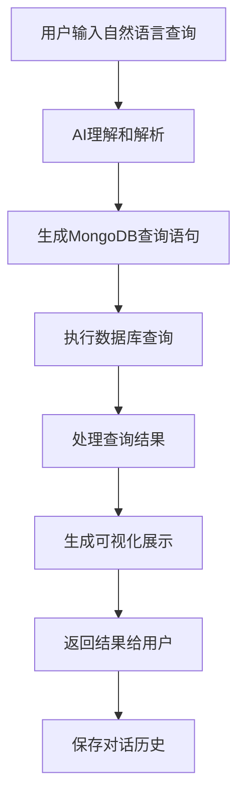
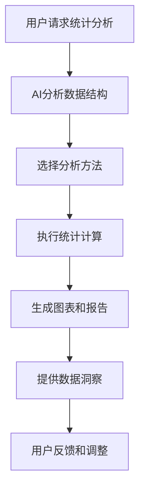

# MongoDB可视化工具AI功能集成需求文档

## 1. 产品概述

本文档描述了在MongoDB可视化工具中集成AI对话功能的需求，让用户能够通过自然语言与AI助手对话来查询MongoDB数据、生成统计报告和执行数据分析任务。

* **核心价值**：降低数据查询门槛，让非技术用户也能轻松获取数据洞察

* **目标用户**：数据分析师、产品经理、业务人员、开发者

* **解决问题**：复杂的MongoDB查询语法学习成本高，数据统计分析需要专业技能

## 2. 核心功能

### 2.1 用户角色

| 角色   | 使用场景      | 核心权限                |
| ---- | --------- | ------------------- |
| 普通用户 | 基础数据查询和浏览 | 可进行简单的AI对话查询，查看基础统计 |
| 高级用户 | 复杂数据分析和报告 | 可使用高级AI分析功能，生成详细报告  |
| 管理员  | 系统配置和用户管理 | 可配置AI模型参数，管理用户权限    |

### 2.2 功能模块

我们的AI功能集成包含以下主要模块：

1. **AI对话界面**：智能聊天窗口，自然语言交互，上下文理解
2. **智能查询生成**：将自然语言转换为MongoDB查询语句
3. **数据统计分析**：AI驱动的数据洞察和趋势分析
4. **报告生成**：自动生成可视化图表和分析报告
5. **查询历史管理**：保存和管理AI对话历史和查询结果

### 2.3 页面详情

| 页面名称   | 模块名称   | 功能描述                           |
| ------ | ------ | ------------------------------ |
| AI助手页面 | 对话界面   | 提供聊天窗口，支持文本输入、语音输入，显示AI回复和查询结果 |
| AI助手页面 | 智能提示   | 提供查询建议、常用问题模板、语法提示             |
| AI助手页面 | 结果展示   | 以表格、图表、文本等形式展示查询结果和分析报告        |
| 数据浏览页面 | AI快捷查询 | 在现有数据浏览页面集成AI查询按钮和快捷对话框        |
| 统计分析页面 | AI洞察   | AI自动分析数据趋势，生成洞察报告和建议           |
| 设置页面   | AI配置   | 配置AI模型参数、API密钥、响应偏好等           |

## 3. 核心流程

### 3.1 AI对话查询流程

用户通过自然语言与AI助手对话，AI理解用户意图并生成相应的MongoDB查询，执行查询后将结果以友好的方式展示给用户。



### 3.2 智能统计分析流程

用户请求数据统计分析，AI自动选择合适的分析方法，生成统计报告和可视化图表。



## 4. 用户界面设计

### 4.1 设计风格

* **主色调**：保持与现有系统一致的蓝色系（#3B82F6）和深色主题

* **AI元素色彩**：使用渐变色彩（紫色到蓝色）突出AI功能区域

* **按钮样式**：圆角设计，AI相关按钮使用渐变背景

* **字体**：Inter字体，AI对话使用16px，代码显示使用Monaco字体

* **布局风格**：卡片式设计，AI对话采用气泡式布局

* **图标风格**：使用Lucide图标库，AI功能使用机器人、魔法棒等图标

### 4.2 页面设计概览

| 页面名称   | 模块名称   | UI元素                        |
| ------ | ------ | --------------------------- |
| AI助手页面 | 对话界面   | 聊天气泡、输入框、发送按钮、语音输入按钮、清空对话按钮 |
| AI助手页面 | 侧边栏    | 对话历史列表、新建对话按钮、设置按钮          |
| AI助手页面 | 结果展示区  | 数据表格、图表容器、代码高亮显示、复制按钮       |
| 数据浏览页面 | AI快捷入口 | 浮动AI按钮、快捷对话框、智能建议卡片         |
| 统计分析页面 | AI洞察面板 | 洞察卡片、趋势图表、建议列表、刷新按钮         |

### 4.3 响应式设计

* **桌面优先**：主要针对桌面端设计，支持大屏幕多窗口操作

* **移动适配**：AI对话界面支持移动端触摸操作和语音输入

* **平板优化**：在平板设备上提供侧边栏折叠和手势操作

## 5. AI功能详细设计

### 5.1 自然语言理解能力

**支持的查询类型**：

* 基础查询："显示所有用户"、"查找名字包含张的用户"

* 条件查询："查找年龄大于25岁的用户"、"显示最近一周的订单"

* 聚合查询："统计每个城市的用户数量"、"计算平均订单金额"

* 排序查询："按创建时间排序显示产品"、"找出销量最高的10个产品"

* 复杂查询："查找购买过iPhone且年龄在20-30岁之间的用户"

**上下文理解**：

* 记住对话历史，支持追问和补充查询

* 理解代词引用："再显示他们的订单信息"

* 支持查询修正："不对，我要的是最近一个月的数据"

### 5.2 查询生成能力

**MongoDB查询语法支持**：

* find()查询：基础文档查询和条件过滤

* aggregate()管道：复杂的聚合分析和数据处理

* 索引优化：AI自动选择最优的查询路径

* 性能提示：对可能慢查询给出优化建议

**查询验证**：

* 语法检查：确保生成的查询语法正确

* 安全验证：防止危险操作（删除、更新等）

* 性能评估：预估查询执行时间和资源消耗

### 5.3 数据分析能力

**统计分析功能**：

* 描述性统计：均值、中位数、标准差、分位数

* 趋势分析：时间序列分析、增长率计算

* 分布分析：数据分布图、异常值检测

* 关联分析：字段间相关性分析

**可视化生成**：

* 自动选择合适的图表类型（柱状图、折线图、饼图等）

* 支持交互式图表（缩放、筛选、钻取）

* 生成数据洞察文本说明

### 5.4 报告生成能力

**报告类型**：

* 数据概览报告：数据量、字段分布、数据质量

* 业务分析报告：用户行为、销售趋势、产品分析

* 技术报告：性能分析、索引建议、优化方案

**导出功能**：

* PDF报告：包含图表和分析文本

* Excel表格：原始数据和统计结果

* 图片导出：单独导出图表和可视化

## 6. 技术实现方案

### 6.1 AI模型集成

**大语言模型选择**：

* 主要模型：OpenAI GPT-4或Claude-3.5-Sonnet

* 备选方案：本地部署的开源模型（Llama、Qwen等）

* 模型切换：支持用户选择不同的AI模型

**Prompt工程**：

* 系统提示词：定义AI助手的角色和能力边界

* 查询模板：预定义常见查询的模板和示例

* 上下文管理：维护对话历史和数据库schema信息

### 6.2 后端架构扩展

**新增API接口**：

```
POST /api/ai/chat - AI对话接口
POST /api/ai/query - 智能查询生成
POST /api/ai/analyze - 数据分析请求
GET /api/ai/history - 获取对话历史
POST /api/ai/report - 生成分析报告
```

**服务架构**：

* AI服务层：处理自然语言理解和查询生成

* 查询执行层：安全执行MongoDB查询

* 分析引擎：数据统计和可视化生成

* 缓存层：缓存常用查询结果和AI响应

### 6.3 前端组件设计

**新增React组件**：

* `AIChat`：AI对话主界面组件

* `QueryBuilder`：智能查询构建器

* `DataInsights`：数据洞察展示组件

* `ReportGenerator`：报告生成器

* `VoiceInput`：语音输入组件

**状态管理**：

* 使用Zustand管理AI对话状态

* 缓存对话历史和查询结果

* 管理AI模型配置和用户偏好

### 6.4 安全和隐私

**数据安全**：

* API密钥加密存储

* 查询结果脱敏处理

* 用户数据不发送给第三方AI服务

**权限控制**：

* 基于角色的AI功能访问控制

* 查询操作白名单机制

* 敏感数据访问审计

## 7. 用户体验设计

### 7.1 交互设计原则

**自然对话**：

* 支持多轮对话，理解上下文

* 提供智能提示和自动补全

* 错误时给出友好的建议和修正

**即时反馈**：

* 实时显示AI思考过程

* 查询执行进度提示

* 结果加载动画和状态提示

**学习适应**：

* 记住用户常用查询模式

* 个性化推荐和建议

* 根据用户反馈优化响应

### 7.2 帮助和引导

**新手引导**：

* AI功能介绍和使用教程

* 示例查询和最佳实践

* 分步骤的功能演示

**帮助文档**：

* 支持的查询语法说明

* 常见问题和解决方案

* AI功能限制和注意事项

### 7.3 性能优化

**响应速度**：

* AI响应时间控制在3秒内

* 查询结果分页加载

* 智能缓存常用查询

**资源管理**：

* 限制并发AI请求数量

* 优化大数据集的处理

* 合理的超时和重试机制

## 8. 实施计划

### 8.1 开发阶段

**第一阶段（2周）**：

* 基础AI对话界面开发

* 简单查询生成功能

* 基础的自然语言理解

**第二阶段（3周）**：

* 复杂查询和聚合支持

* 数据可视化集成

* 对话历史管理

**第三阶段（2周）**：

* 智能分析和报告生成

* 性能优化和安全加固

* 用户体验完善

### 8.2 测试和部署

**测试策略**：

* 单元测试：AI功能模块测试

* 集成测试：端到端查询流程测试

* 用户测试：真实场景下的可用性测试

**部署方案**：

* 灰度发布：先向部分用户开放AI功能

* 监控告警：AI服务性能和错误监控

* 回滚机制：出现问题时快速回滚

## 9. 成功指标

### 9.1 功能指标

* **查询准确率**：AI生成查询的正确率 > 90%

* **响应时间**：AI响应时间 < 3秒

* **用户满意度**：用户对AI功能的满意度评分 > 4.0/5.0

### 9.2 业务指标

* **功能使用率**：AI功能的日活跃用户占比 > 30%

* **查询效率**：使用AI后查询效率提升 > 50%

* **用户留存**：AI功能用户的月留存率 > 80%

### 9.3 技术指标

* **系统稳定性**：AI服务可用性 > 99.5%

* **错误率**：AI功能错误率 < 1%

* **资源消耗**：AI功能对系统性能影响 < 10%

