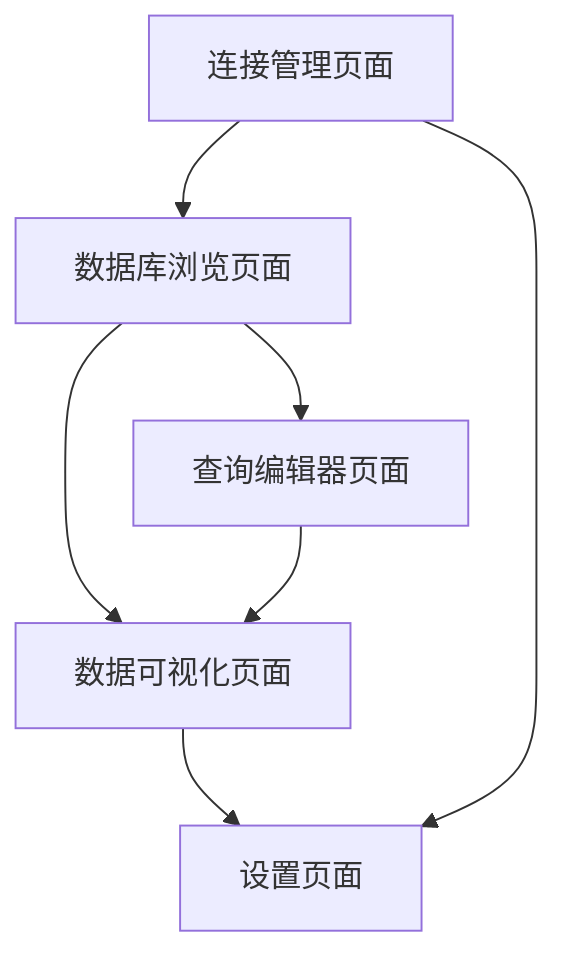

# MongoDB可视化工具产品需求文档

## 1. 产品概述
MongoDB可视化工具是一个现代化的数据库管理平台，为开发者和数据分析师提供直观、高效的MongoDB数据库操作体验。
- 解决传统命令行操作复杂、学习成本高的问题，让用户通过可视化界面轻松管理MongoDB数据库。
- 目标用户包括后端开发者、数据分析师、数据库管理员等需要频繁操作MongoDB的专业人员。
- 产品目标是成为MongoDB生态中最受欢迎的第三方可视化管理工具，提升用户的数据库操作效率。

## 2. 核心功能

### 2.1 用户角色
| 角色 | 注册方式 | 核心权限 |
|------|----------|----------|
| 普通用户 | 邮箱注册或本地使用 | 可连接数据库、浏览数据、执行基础查询 |
| 高级用户 | 付费升级 | 可使用高级查询、数据导入导出、性能监控等功能 |

### 2.2 功能模块
我们的MongoDB可视化工具包含以下核心页面：
1. **连接管理页面**：数据库连接配置、连接状态监控、连接历史记录。
2. **数据库浏览页面**：数据库列表、集合浏览、索引管理、数据统计。
3. **查询编辑器页面**：MongoDB查询语句编写、查询结果展示、查询历史。
4. **数据可视化页面**：图表生成、数据分析、可视化配置。
5. **设置页面**：主题配置、快捷键设置、导入导出配置。

### 2.3 页面详情
| 页面名称 | 模块名称 | 功能描述 |
|----------|----------|----------|
| 连接管理页面 | 连接配置 | 创建、编辑、删除MongoDB连接，支持URI和表单两种配置方式 |
| 连接管理页面 | 连接测试 | 测试数据库连接状态，显示连接延迟和服务器信息 |
| 连接管理页面 | 连接历史 | 保存最近使用的连接，支持快速重连和连接分组 |
| 数据库浏览页面 | 数据库列表 | 显示所有数据库，展示大小、集合数量等统计信息 |
| 数据库浏览页面 | 集合浏览 | 浏览集合中的文档，支持分页、搜索、排序功能 |
| 数据库浏览页面 | 索引管理 | 查看、创建、删除索引，显示索引使用统计 |
| 查询编辑器页面 | 查询编写 | 提供MongoDB查询语法高亮、自动补全、语法检查 |
| 查询编辑器页面 | 结果展示 | 以表格、JSON、树形等多种格式展示查询结果 |
| 查询编辑器页面 | 查询历史 | 保存查询历史，支持收藏常用查询和查询模板 |
| 数据可视化页面 | 图表生成 | 根据数据自动生成柱状图、饼图、折线图等可视化图表 |
| 数据可视化页面 | 数据分析 | 提供数据聚合分析、趋势分析、异常检测功能 |
| 设置页面 | 主题配置 | 支持明暗主题切换、自定义颜色方案 |
| 设置页面 | 导入导出 | 支持JSON、CSV格式的数据导入导出功能 |

## 3. 核心流程

**主要用户操作流程：**
用户首先在连接管理页面配置MongoDB连接信息，测试连接成功后进入数据库浏览页面查看数据库和集合列表。用户可以直接浏览集合数据，或者切换到查询编辑器页面编写复杂查询语句。对于需要数据分析的场景，用户可以在数据可视化页面生成图表和进行数据分析。

## 4. 用户界面设计

### 4.1 设计风格
- **主色调**：深蓝色 (#1e40af) 作为主色，浅蓝色 (#3b82f6) 作为辅助色
- **按钮样式**：圆角按钮设计，支持悬停和点击动画效果
- **字体**：Inter字体作为主要字体，代码区域使用 JetBrains Mono 等宽字体
- **布局风格**：现代化卡片式布局，左侧导航栏 + 主内容区域的经典布局
- **图标风格**：使用 Lucide React 图标库，保持简洁现代的视觉风格

### 4.2 页面设计概览

| 页面名称 | 模块名称 | UI元素 |
|----------|----------|--------|
| 连接管理页面 | 连接配置 | 表单输入框、下拉选择器、测试连接按钮，使用卡片布局展示连接信息 |
| 数据库浏览页面 | 集合浏览 | 树形导航、数据表格、分页组件，支持虚拟滚动优化性能 |
| 查询编辑器页面 | 查询编写 | 代码编辑器、语法高亮、自动补全下拉框，分屏显示查询和结果 |
| 数据可视化页面 | 图表生成 | 图表配置面板、可视化画布、图表类型选择器，支持拖拽交互 |
| 设置页面 | 主题配置 | 开关组件、颜色选择器、预览区域，实时预览主题效果 |

### 4.3 响应式设计
产品采用桌面优先的响应式设计，在平板设备上自适应布局，支持触摸操作优化，确保在不同屏幕尺寸下都能提供良好的用户体验。