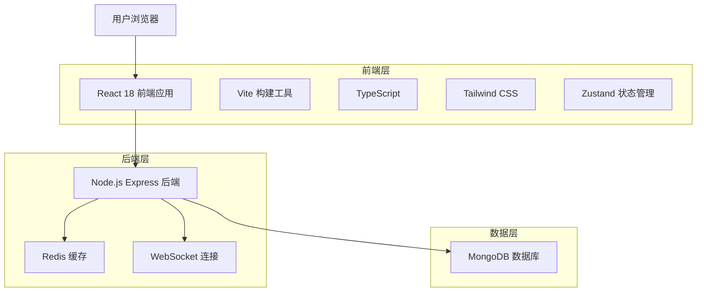
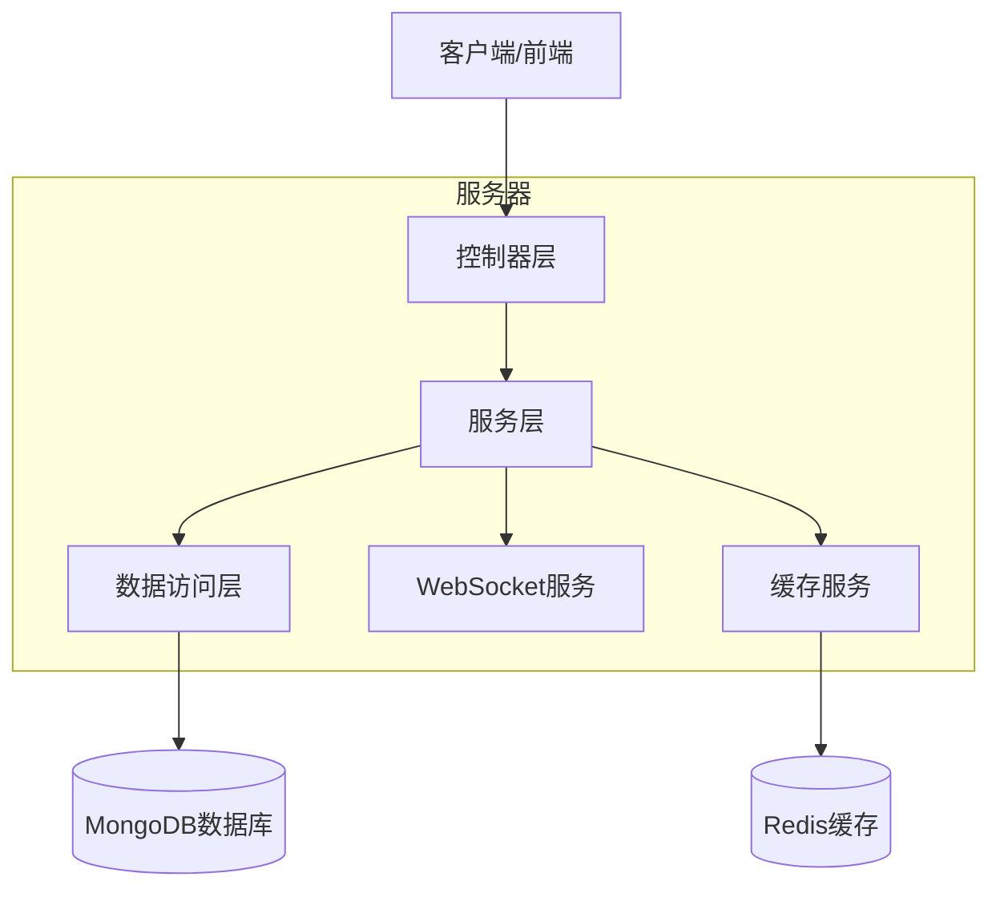
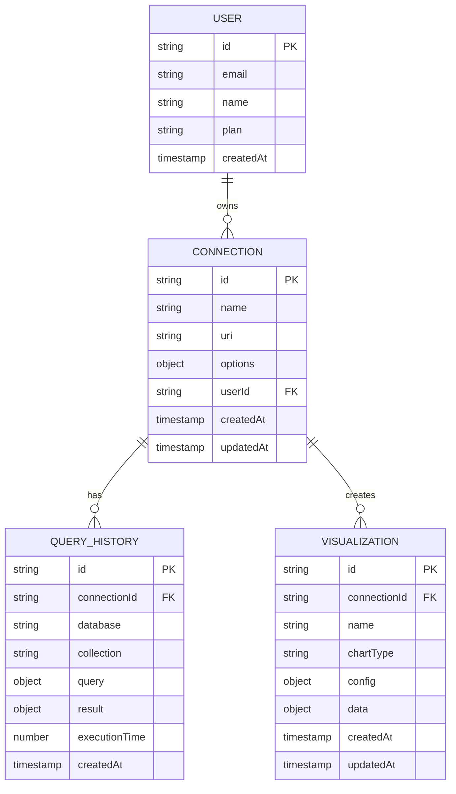

# MongoDB可视化工具技术架构文档

## 1. 架构设计



## 2. 技术描述

* **前端**: React\@18 + TypeScript\@5 + Vite\@5 + Tailwind CSS\@3 + Zustand\@4

* **后端**: Node.js\@20 + Express\@4 + Socket.io\@4

* **数据库**: MongoDB\@7 + Redis\@7

* **可视化**: Recharts\@2 + D3.js\@7

* **代码编辑器**: Monaco Editor\@0.45

* **UI组件**: Radix UI + Lucide React

## 3. 路由定义

| 路由                       | 用途                     |
| ------------------------ | ---------------------- |
| /                        | 首页，显示连接管理界面            |
| /connections             | 连接管理页面，配置和管理数据库连接      |
| /database/:connectionId  | 数据库浏览页面，显示数据库和集合列表     |
| /query/:connectionId     | 查询编辑器页面，编写和执行MongoDB查询 |
| /visualize/:connectionId | 数据可视化页面，生成图表和数据分析      |
| /settings                | 设置页面，配置应用偏好和主题         |

## 4. API定义

### 4.1 核心API

**连接管理相关**

```
POST /api/connections
```

请求参数:

| 参数名称    | 参数类型   | 是否必需  | 描述           |
| ------- | ------ | ----- | ------------ |
| name    | string | true  | 连接名称         |
| uri     | string | true  | MongoDB连接URI |
| options | object | false | 连接选项配置       |

响应参数:

| 参数名称         | 参数类型    | 描述     |
| ------------ | ------- | ------ |
| success      | boolean | 操作是否成功 |
| connectionId | string  | 连接ID   |
| message      | string  | 响应消息   |

请求示例:

```json
{
  "name": "本地开发环境",
  "uri": "mongodb://localhost:27017",
  "options": {
    "maxPoolSize": 10,
    "serverSelectionTimeoutMS": 5000
  }
}
```

**数据库查询相关**

```
POST /api/query/:connectionId
```

请求参数:

| 参数名称       | 参数类型   | 是否必需  | 描述          |
| ---------- | ------ | ----- | ----------- |
| database   | string | true  | 数据库名称       |
| collection | string | true  | 集合名称        |
| query      | object | true  | MongoDB查询对象 |
| options    | object | false | 查询选项        |

响应参数:

| 参数名称          | 参数类型    | 描述       |
| ------------- | ------- | -------- |
| success       | boolean | 查询是否成功   |
| data          | array   | 查询结果数据   |
| count         | number  | 结果总数     |
| executionTime | number  | 执行时间(毫秒) |

**数据可视化相关**

```
POST /api/visualize/:connectionId
```

请求参数:

| 参数名称        | 参数类型   | 是否必需 | 描述    |
| ----------- | ------ | ---- | ----- |
| database    | string | true | 数据库名称 |
| collection  | string | true | 集合名称  |
| aggregation | array  | true | 聚合管道  |
| chartType   | string | true | 图表类型  |

响应参数:

| 参数名称      | 参数类型    | 描述     |
| --------- | ------- | ------ |
| success   | boolean | 操作是否成功 |
| chartData | object  | 图表数据   |
| metadata  | object  | 数据元信息  |

## 5. 服务器架构图



## 6. 数据模型

### 6.1 数据模型定义



### 6.2 数据定义语言

**连接表 (connections)**

```sql
-- 创建连接表
CREATE TABLE connections (
    id UUID PRIMARY KEY DEFAULT gen_random_uuid(),
    name VARCHAR(255) NOT NULL,
    uri TEXT NOT NULL,
    options JSONB DEFAULT '{}',
    user_id UUID REFERENCES users(id),
    created_at TIMESTAMP WITH TIME ZONE DEFAULT NOW(),
    updated_at TIMESTAMP WITH TIME ZONE DEFAULT NOW()
);

-- 创建索引
CREATE INDEX idx_connections_user_id ON connections(user_id);
CREATE INDEX idx_connections_created_at ON connections(created_at DESC);
```

**查询历史表 (query\_history)**

```sql
-- 创建查询历史表
CREATE TABLE query_history (
    id UUID PRIMARY KEY DEFAULT gen_random_uuid(),
    connection_id UUID REFERENCES connections(id) ON DELETE CASCADE,
    database_name VARCHAR(255) NOT NULL,
    collection_name VARCHAR(255) NOT NULL,
    query JSONB NOT NULL,
    result JSONB,
    execution_time INTEGER DEFAULT 0,
    created_at TIMESTAMP WITH TIME ZONE DEFAULT NOW()
);

-- 创建索引
CREATE INDEX idx_query_history_connection_id ON query_history(connection_id);
CREATE INDEX idx_query_history_created_at ON query_history(created_at DESC);
```

**可视化配置表 (visualizations)**

```sql
-- 创建可视化表
CREATE TABLE visualizations (
    id UUID PRIMARY KEY DEFAULT gen_random_uuid(),
    connection_id UUID REFERENCES connections(id) ON DELETE CASCADE,
    name VARCHAR(255) NOT NULL,
    chart_type VARCHAR(50) NOT NULL,
    config JSONB NOT NULL,
    data JSONB,
    created_at TIMESTAMP WITH TIME ZONE DEFAULT NOW(),
    updated_at TIMESTAMP WITH TIME ZONE DEFAULT NOW()
);

-- 创建索引
CREATE INDEX idx_visualizations_connection_id ON visualizations(connection_id);
CREATE INDEX idx_visualizations_chart_type ON visualizations(chart_type);

-- 初始化数据
INSERT INTO visualizations (connection_id, name, chart_type, config) VALUES
('example-connection-id', '用户分布图', 'pie', '{"field": "userType", "colors": ["#3b82f6", "#ef4444", "#10b981"]}'),
('example-connection-id', '月度趋势', 'line', '{"xField": "month
```

