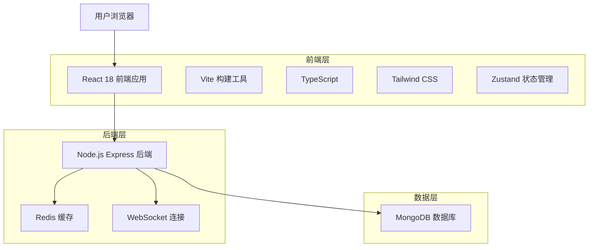
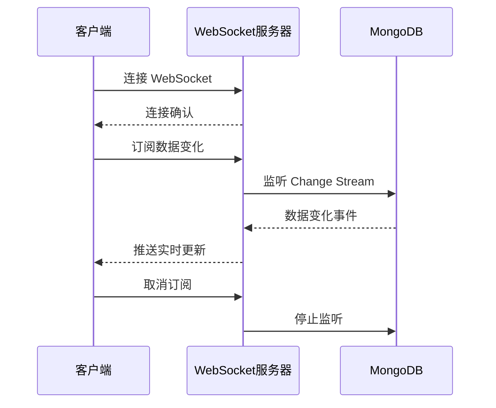
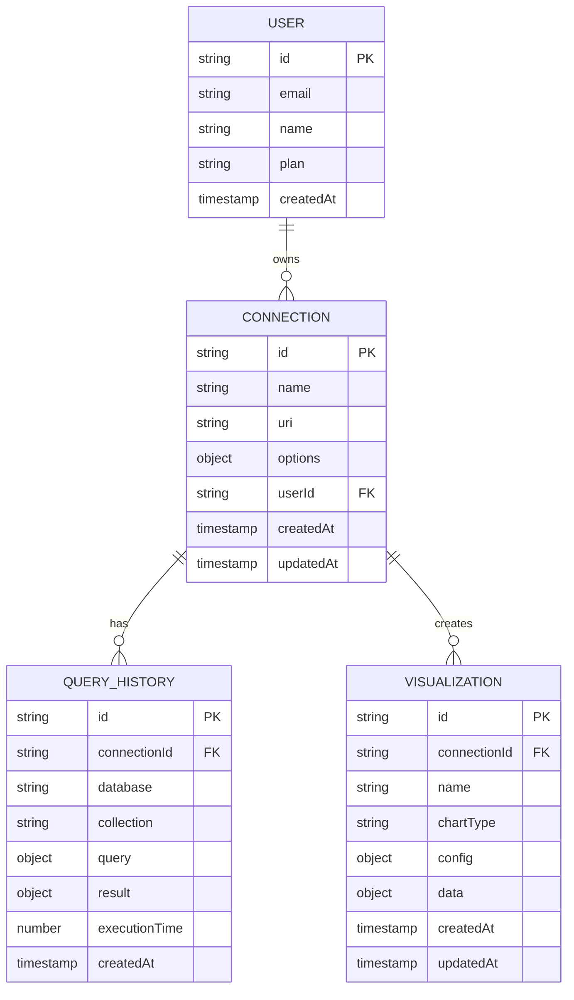
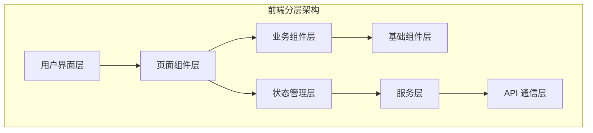
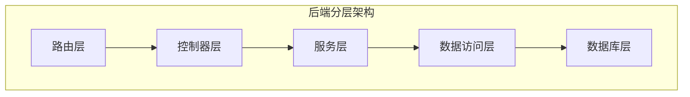
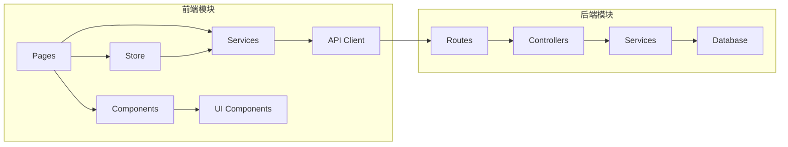
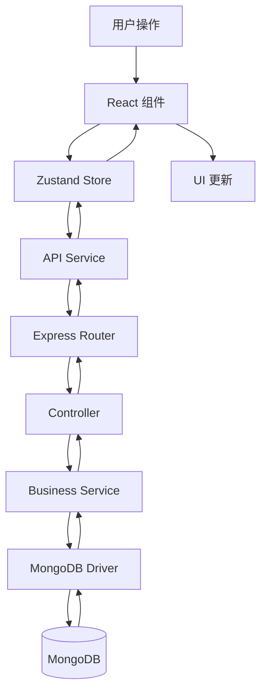

# MongoDB 可视化工具

<div align="center">
  
</div>

一个现代化的 MongoDB 数据库可视化和管理工具，提供直观的界面来浏览、查询和管理 MongoDB 数据库。

## 🖥️ 界面预览

<div align="center">
  
  <p><em>主界面展示数据库浏览器、文档编辑器和实时数据可视化</em></p>
</div>

## ✨ 功能特性

<div align="center">
  
</div>

### 🔗 连接管理
- 支持多个 MongoDB 连接配置
- 连接测试和验证
- 安全的连接信息存储
- 连接状态实时监控

### 🗂️ 数据库浏览
- 数据库和集合的树形结构浏览
- 文档列表查看和分页
- 文档详情展示
- 集合统计信息

### ✏️ 文档编辑
- 可视化文档编辑器
- JSON 格式验证
- 实时保存功能
- 新建和删除文档
- 批量操作支持

### 🌳 树形视图
- JSON 数据的树形展示
- 展开/折叠控制
- 搜索和高亮显示
- 嵌套对象支持

### 🔍 查询编辑器
- MongoDB 查询语法支持
- 查询历史记录
- 结果集可视化
- 聚合查询支持

### 📊 数据可视化
- 图表展示数据分布
- 多种图表类型支持
- 交互式数据探索
- 导出功能

### 💻 代码生成
- 自动生成 Golang 结构体
- 支持 `json` 和 `bson` 标签
- 查询代码生成
- 类型映射优化

### 🎨 用户体验
- 现代化 UI 设计
- 深色/浅色主题切换
- 响应式布局
- 快捷键支持

## 🔄 用户工作流程

<div align="center">
  
  <p><em>从数据库连接到代码生成的完整工作流程</em></p>
</div>

## 🏗️ 系统架构

### 整体架构设计

<div align="center">
  
  <p><em>三层架构：前端展示层、后端服务层、数据存储层</em></p>
</div>

我们的 MongoDB 可视化工具采用现代化的三层架构设计：

#### 🎨 前端展示层 (Presentation Layer)
- **用户界面**: React 18 + TypeScript 构建的现代化 SPA
- **状态管理**: Zustand 轻量级状态管理
- **路由系统**: React Router 单页面应用路由
- **样式系统**: Tailwind CSS 实用优先的样式框架
- **构建工具**: Vite 快速开发和构建

#### ⚙️ 后端服务层 (Service Layer)
- **API 服务**: Node.js + Express.js RESTful API
- **数据库驱动**: MongoDB Native Driver
- **实时通信**: WebSocket 支持实时数据更新
- **缓存层**: Redis 查询结果缓存
- **类型安全**: TypeScript 端到端类型安全

#### 💾 数据存储层 (Data Layer)
- **主数据库**: MongoDB 文档数据库
- **缓存数据库**: Redis 内存数据库
- **数据持久化**: Docker 卷持久化存储

### 技术架构图



### 数据流架构

```mermaid
sequenceDiagram
    participant U as 用户界面
    participant F as 前端应用
    participant B as 后端API
    participant M as MongoDB
    participant R as Redis缓存
    
    U->>F: 用户操作
    F->>B: API 请求
    B->>R: 检查缓存
    alt 缓存命中
        R-->>B: 返回缓存数据
    else 缓存未命中
        B->>M: 查询数据库
        M-->>B: 返回数据
        B->>R: 更新缓存
    end
    B-->>F: 返回响应
    F-->>U: 更新界面
```



### 组件架构

```mermaid
graph TB
    subgraph "前端组件架构"
        A[App.tsx] --> B[Layout.tsx]
        B --> C[Connections.tsx]
        B --> D[DatabaseBrowser.tsx]
        B --> E[QueryEditor.tsx]
        B --> F[DataVisualization.tsx]
        B --> G[Settings.tsx]
        
        C --> H[ConnectionForm]
        D --> I[TreeView]
        D --> J[DocumentEditor]
        E --> K[MonacoEditor]
        F --> L[Charts]
    end
    
    subgraph "后端路由架构"
        M[app.ts] --> N[/api/connections]
        M --> O[/api/query]
        M --> P[/api/visualize]
        M --> Q[/api/auth]
    end
```

## 🛠️ 技术栈

### 前端技术栈
- **React 18** - 用户界面框架，支持并发特性
- **TypeScript 5** - 类型安全的 JavaScript 超集
- **Vite 5** - 快速构建工具和开发服务器
- **Tailwind CSS 3** - 实用优先的 CSS 框架
- **Zustand 4** - 轻量级状态管理库
- **React Router 6** - 声明式路由管理
- **Lucide React** - 现代化图标库
- **Recharts 2** - React 图表库
- **Monaco Editor** - VS Code 同款代码编辑器

### 后端技术栈
- **Node.js 20** - JavaScript 运行时环境
- **Express.js 4** - 快速、极简的 Web 框架
- **MongoDB Driver** - 官方 MongoDB 数据库驱动
- **Socket.io 4** - 实时双向通信库
- **TypeScript 5** - 后端类型安全
- **Nodemon** - 开发时自动重启工具

### 数据库技术栈
- **MongoDB 7** - 文档型 NoSQL 数据库
- **Redis 7** - 内存数据库，用于缓存
- **Docker** - 容器化部署
- **Docker Compose** - 多容器编排

### 开发工具链
- **ESLint** - 代码质量检查
- **Prettier** - 代码格式化
- **Git** - 版本控制
- **GitHub Actions** - CI/CD 自动化
- **Vercel** - 前端部署平台

## 🔌 API 架构

### RESTful API 设计

我们的后端 API 遵循 RESTful 设计原则，提供清晰、一致的接口：

#### 核心 API 端点

| 端点 | 方法 | 描述 | 认证 |
|------|------|------|------|
| `/api/connections` | GET | 获取连接列表 | ✅ |
| `/api/connections` | POST | 创建新连接 | ✅ |
| `/api/connections/:id` | PUT | 更新连接配置 | ✅ |
| `/api/connections/:id` | DELETE | 删除连接 | ✅ |
| `/api/connections/:id/test` | POST | 测试连接 | ✅ |
| `/api/query/:connectionId` | POST | 执行数据库查询 | ✅ |
| `/api/visualize/:connectionId` | POST | 生成数据可视化 | ✅ |
| `/api/databases/:connectionId` | GET | 获取数据库列表 | ✅ |
| `/api/collections/:connectionId/:database` | GET | 获取集合列表 | ✅ |

#### API 响应格式

所有 API 响应都遵循统一的格式：

```json
{
  "success": true,
  "data": {
    // 响应数据
  },
  "message": "操作成功",
  "timestamp": "2024-01-15T10:30:00Z",
  "requestId": "req_123456789"
}
```

错误响应格式：

```json
{
  "success": false,
  "error": {
    "code": "VALIDATION_ERROR",
    "message": "请求参数验证失败",
    "details": [
      {
        "field": "uri",
        "message": "MongoDB URI 格式不正确"
      }
    ]
  },
  "timestamp": "2024-01-15T10:30:00Z",
  "requestId": "req_123456789"
}
```

### WebSocket 实时通信



## 📊 数据模型

### 实体关系图



### 数据类型定义

#### Connection 连接配置

```typescript
interface Connection {
  id: string;
  name: string;
  uri: string;
  options: {
    maxPoolSize?: number;
    serverSelectionTimeoutMS?: number;
    ssl?: boolean;
    authSource?: string;
  };
  userId: string;
  createdAt: Date;
  updatedAt: Date;
}
```

#### Query 查询对象

```typescript
interface QueryRequest {
  database: string;
  collection: string;
  query: object;
  options?: {
    limit?: number;
    skip?: number;
    sort?: object;
    projection?: object;
  };
}

interface QueryResult {
  success: boolean;
  data: any[];
  count: number;
  executionTime: number;
  metadata: {
    database: string;
    collection: string;
    totalDocuments: number;
  };
}
```

#### Visualization 可视化配置

```typescript
interface Visualization {
  id: string;
  connectionId: string;
  name: string;
  chartType: 'bar' | 'line' | 'pie' | 'scatter' | 'area';
  config: {
    xField?: string;
    yField?: string;
    colorField?: string;
    aggregation?: object[];
    filters?: object;
  };
  data: any[];
  createdAt: Date;
  updatedAt: Date;
}
```

## 🚀 快速开始

### 环境要求
- Node.js 18+ 
- npm 或 pnpm
- MongoDB 数据库

### 安装依赖

```bash
# 克隆项目
git clone <repository-url>
cd mongo_view

# 安装依赖
npm install
# 或
pnpm install
```

### 开发环境运行

```bash
# 启动开发服务器（前端 + 后端）
npm run dev

# 或分别启动
npm run dev:client  # 前端开发服务器
npm run dev:server  # 后端开发服务器
```

### 生产环境构建

```bash
# 构建项目
npm run build

# 预览构建结果
npm run preview
```

### 📸 界面截图

<details>
<summary>🖼️ 查看应用界面截图</summary>

#### 主控制台
<div align="center">
  
  <p><em>完整界面展示数据库浏览器、文档编辑器和数据可视化</em></p>
</div>

#### 系统架构
<div align="center">
  
  <p><em>系统架构展示前端、后端和数据库层</em></p>
</div>

#### 功能亮点
<div align="center">
  
  <p><em>所有可用功能和技术的综合概览</em></p>
</div>

#### 用户工作流程
<div align="center">
  
  <p><em>从连接设置到代码生成的分步工作流程</em></p>
</div>

</details>

## 🐳 Docker 一键部署

### 环境要求
- Docker 20.10+
- Docker Compose 2.0+

### 快速部署

#### 方式一：使用部署脚本（推荐）

**Linux/macOS:**
```bash
# 给脚本执行权限
chmod +x deploy.sh

# 一键启动所有服务
./deploy.sh start

# 查看服务状态
./deploy.sh logs

# 停止服务
./deploy.sh stop

# 清理所有资源
./deploy.sh clean
```

**Windows:**
```cmd
# 一键启动所有服务
deploy.bat start

# 查看服务状态
deploy.bat logs

# 停止服务
deploy.bat stop

# 清理所有资源
deploy.bat clean
```

#### 方式二：使用 Docker Compose

```bash
# 构建并启动所有服务
docker-compose up -d --build

# 查看服务状态
docker-compose ps

# 查看日志
docker-compose logs -f

# 停止服务
docker-compose down

# 停止服务并删除数据卷
docker-compose down -v
```

### 服务访问地址

部署成功后，可通过以下地址访问：

- **前端应用**: http://localhost:3000
- **后端API**: http://localhost:3001
- **MongoDB**: mongodb://localhost:27017
  - 用户名: `admin`
  - 密码: `password123`
  - 数据库: `mongo_view`

### Docker 服务说明

| 服务 | 容器名 | 端口 | 说明 |
|------|--------|------|------|
| frontend | mongo_view_frontend | 3000:80 | React 前端应用 |
| backend | mongo_view_backend | 3001:3001 | Node.js API 服务 |
| mongodb | mongo_view_db | 27017:27017 | MongoDB 数据库 |

### 数据持久化

- MongoDB 数据存储在 Docker 卷 `mongodb_data` 中
- 即使删除容器，数据也会保留
- 如需完全清理数据，使用 `./deploy.sh clean` 或 `docker-compose down -v`

### 自定义配置

可以通过修改 `docker-compose.yml` 文件来自定义配置：

```yaml
# 修改端口映射
ports:
  - "8080:80"  # 前端端口改为 8080
  - "8081:3001"  # 后端端口改为 8081

# 修改环境变量
environment:
  MONGO_INITDB_ROOT_PASSWORD: your_password
```

### 故障排除

**常见问题：**

1. **端口冲突**
   ```bash
   # 检查端口占用
   netstat -tulpn | grep :3000
   # 或修改 docker-compose.yml 中的端口映射
   ```

2. **服务启动失败**
   ```bash
   # 查看详细日志
   docker-compose logs [service_name]
   ```

3. **数据库连接失败**
   ```bash
   # 检查 MongoDB 服务状态
   docker-compose exec mongodb mongosh --eval "db.adminCommand('ping')"
   ```

4. **清理并重新部署**
   ```bash
   # 完全清理后重新部署
   ./deploy.sh clean
   ./deploy.sh start
   ```

## 📖 使用指南

### 1. 添加 MongoDB 连接
1. 打开应用后，点击「连接管理」
2. 点击「新建连接」
3. 填写连接信息（主机、端口、数据库名等）
4. 点击「测试连接」验证
5. 保存连接配置

### 2. 浏览数据库
1. 选择已配置的连接
2. 在左侧树形结构中浏览数据库和集合
3. 点击集合查看文档列表
4. 点击文档查看详细内容

### 3. 编辑文档
1. 在文档列表中点击「编辑」按钮
2. 在弹出的编辑器中修改 JSON 内容
3. 点击「保存」提交更改
4. 支持新建和删除操作

### 4. 执行查询
1. 进入「查询编辑器」页面
2. 选择目标数据库和集合
3. 输入 MongoDB 查询语句
4. 点击「执行」查看结果
5. 查看查询历史记录

### 5. 数据可视化
1. 进入「数据可视化」页面
2. 选择数据源和字段
3. 选择图表类型
4. 自定义图表配置
5. 导出图表或数据

## 🔧 配置说明

### 环境变量
创建 `.env` 文件配置环境变量：

```env
# 服务器端口
PORT=3001

# MongoDB 连接（可选，用于默认连接）
MONGODB_URI=mongodb://localhost:27017

# 其他配置
NODE_ENV=development
```

### 自定义配置
- 主题配置：在设置页面切换深色/浅色主题
- 查询限制：可在设置中调整查询结果数量限制
- 连接超时：可配置数据库连接超时时间

## 📁 项目架构与结构

### 目录结构说明

```
mongo_view/
├── 📁 src/                     # 前端源码目录
│   ├── 📁 components/          # 可复用 React 组件
│   │   ├── DocumentEditor.tsx  # 文档编辑器组件
│   │   ├── TreeView.tsx        # 树形视图组件
│   │   ├── Layout.tsx          # 布局组件
│   │   └── ui/                 # 基础 UI 组件库
│   ├── 📁 pages/              # 页面级组件
│   │   ├── Connections.tsx     # 连接管理页面
│   │   ├── DatabaseBrowser.tsx # 数据库浏览页面
│   │   ├── QueryEditor.tsx     # 查询编辑器页面
│   │   ├── DataVisualization.tsx # 数据可视化页面
│   │   └── Settings.tsx        # 设置页面
│   ├── 📁 services/           # API 服务层
│   │   └── api.ts             # API 请求封装
│   ├── 📁 store/              # 状态管理
│   │   └── useStore.ts        # Zustand 状态管理
│   ├── 📁 hooks/              # 自定义 React Hooks
│   │   └── useTheme.ts        # 主题切换 Hook
│   └── 📁 lib/                # 工具函数库
│       └── utils.ts           # 通用工具函数
├── 📁 api/                    # 后端源码目录
│   ├── 📁 routes/             # API 路由模块
│   │   ├── connections.ts      # 连接管理路由
│   │   ├── query.ts           # 查询执行路由
│   │   ├── visualize.ts       # 数据可视化路由
│   │   └── auth.ts            # 认证相关路由
│   ├── 📁 config/             # 配置文件
│   │   └── database.ts        # 数据库配置
│   ├── app.ts                 # Express 应用配置
│   ├── server.ts              # 服务器入口文件
│   └── index.ts               # 主入口文件
├── 📁 docker/                 # Docker 相关文件
│   ├── nginx.conf             # Nginx 配置
│   └── mongo-init.js          # MongoDB 初始化脚本
├── 📁 docs/                   # 文档和图片
│   └── 📁 images/             # 架构图和界面图
│       ├── architecture.svg    # 系统架构图
│       ├── features.svg       # 功能特性图
│       ├── interface-mockup.svg # 界面原型图
│       └── workflow.svg       # 工作流程图
├── 📁 scripts/                # 脚本文件
│   └── init-test-data.js      # 测试数据初始化脚本
├── 📁 public/                 # 静态资源
│   └── favicon.svg            # 网站图标
├── 📁 dist/                   # 构建输出目录
├── 📄 docker-compose.yml      # Docker 编排配置
├── 📄 Dockerfile.frontend     # 前端 Docker 镜像
├── 📄 Dockerfile.backend      # 后端 Docker 镜像
├── 📄 package.json            # 项目依赖配置
├── 📄 vite.config.ts          # Vite 构建配置
├── 📄 tailwind.config.js      # Tailwind CSS 配置
└── 📄 tsconfig.json           # TypeScript 配置
```

### 架构分层说明

#### 🎨 前端架构层次



- **用户界面层**: 用户直接交互的界面元素
- **页面组件层**: 完整的页面级组件 (pages/)
- **业务组件层**: 可复用的业务逻辑组件 (components/)
- **基础组件层**: 通用 UI 组件 (components/ui/)
- **状态管理层**: 全局状态管理 (store/)
- **服务层**: 业务逻辑服务 (services/)
- **API 通信层**: 与后端的数据交互

#### ⚙️ 后端架构层次



- **路由层**: API 路由定义和请求分发 (routes/)
- **控制器层**: 请求处理和响应封装
- **服务层**: 核心业务逻辑处理
- **数据访问层**: 数据库操作抽象
- **数据库层**: MongoDB 数据存储

### 模块依赖关系



### 数据流向图



## 🤝 贡献指南

1. Fork 项目
2. 创建特性分支 (`git checkout -b feature/AmazingFeature`)
3. 提交更改 (`git commit -m 'Add some AmazingFeature'`)
4. 推送到分支 (`git push origin feature/AmazingFeature`)
5. 打开 Pull Request

## 📄 许可证

本项目采用 MIT 许可证 - 查看 [LICENSE](LICENSE) 文件了解详情。

## 🆘 支持

如果您遇到问题或有建议，请：
- 提交 [Issue](../../issues)
- 查看 [Wiki](../../wiki) 文档
- 联系维护者

## 🎯 路线图

- [ ] 支持更多数据库类型
- [ ] 添加数据导入/导出功能
- [ ] 实现协作功能
- [ ] 移动端适配
- [ ] 插件系统

---

⭐ 如果这个项目对您有帮助，请给我们一个 Star！
