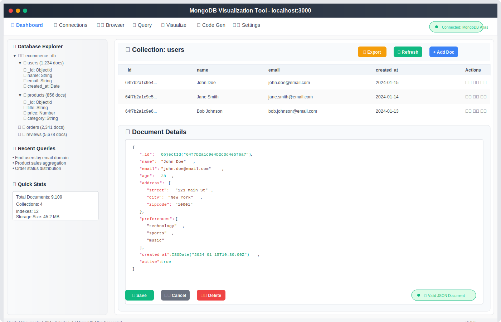

# MongoDB 可视化工具

<div align="center">
  
</div>

一个现代化的 MongoDB 数据库可视化和管理工具，提供直观的界面来浏览、查询和管理 MongoDB 数据库。

## 🖥️ 界面预览

<div align="center">
  
  <p><em>主界面展示数据库浏览器、文档编辑器和实时数据可视化</em></p>
</div>

## ✨ 功能特性

<div align="center">
  
</div>

### 🔗 连接管理
- 支持多个 MongoDB 连接配置
- 连接测试和验证
- 安全的连接信息存储
- 连接状态实时监控

### 🗂️ 数据库浏览
- 数据库和集合的树形结构浏览
- 文档列表查看和分页
- 文档详情展示
- 集合统计信息

### ✏️ 文档编辑
- 可视化文档编辑器
- JSON 格式验证
- 实时保存功能
- 新建和删除文档
- 批量操作支持

### 🌳 树形视图
- JSON 数据的树形展示
- 展开/折叠控制
- 搜索和高亮显示
- 嵌套对象支持

### 🔍 查询编辑器
- MongoDB 查询语法支持
- 查询历史记录
- 结果集可视化
- 聚合查询支持

### 📊 数据可视化
- 图表展示数据分布
- 多种图表类型支持
- 交互式数据探索
- 导出功能

### 💻 代码生成
- 自动生成 Golang 结构体
- 支持 `json` 和 `bson` 标签
- 查询代码生成
- 类型映射优化

### 🎨 用户体验
- 现代化 UI 设计
- 深色/浅色主题切换
- 响应式布局
- 快捷键支持

## 🔄 用户工作流程

<div align="center">
  
  <p><em>从数据库连接到代码生成的完整工作流程</em></p>
</div>

## 🛠️ 技术栈

### 前端
- **React 18** - 用户界面框架
- **TypeScript** - 类型安全的 JavaScript
- **Vite** - 快速构建工具
- **Tailwind CSS** - 实用优先的 CSS 框架
- **Zustand** - 轻量级状态管理
- **React Router** - 路由管理
- **Lucide React** - 图标库
- **Recharts** - 图表库

### 后端
- **Node.js** - 运行时环境
- **Express.js** - Web 框架
- **MongoDB Driver** - 数据库连接
- **TypeScript** - 类型安全

### 开发工具
- **ESLint** - 代码质量检查
- **Prettier** - 代码格式化
- **Nodemon** - 开发时自动重启

## 🚀 快速开始

### 环境要求
- Node.js 18+ 
- npm 或 pnpm
- MongoDB 数据库

### 安装依赖

```bash
# 克隆项目
git clone <repository-url>
cd mongo_view

# 安装依赖
npm install
# 或
pnpm install
```

### 开发环境运行

```bash
# 启动开发服务器（前端 + 后端）
npm run dev

# 或分别启动
npm run dev:client  # 前端开发服务器
npm run dev:server  # 后端开发服务器
```

### 生产环境构建

```bash
# 构建项目
npm run build

# 预览构建结果
npm run preview
```

### 📸 界面截图

<details>
<summary>🖼️ 查看应用界面截图</summary>

#### 主控制台
<div align="center">
  
  <p><em>完整界面展示数据库浏览器、文档编辑器和数据可视化</em></p>
</div>

#### 系统架构
<div align="center">
  
  <p><em>系统架构展示前端、后端和数据库层</em></p>
</div>

#### 功能亮点
<div align="center">
  
  <p><em>所有可用功能和技术的综合概览</em></p>
</div>

#### 用户工作流程
<div align="center">
  
  <p><em>从连接设置到代码生成的分步工作流程</em></p>
</div>

</details>

## 🐳 Docker 一键部署

### 环境要求
- Docker 20.10+
- Docker Compose 2.0+

### 快速部署

#### 方式一：使用部署脚本（推荐）

**Linux/macOS:**
```bash
# 给脚本执行权限
chmod +x deploy.sh

# 一键启动所有服务
./deploy.sh start

# 查看服务状态
./deploy.sh logs

# 停止服务
./deploy.sh stop

# 清理所有资源
./deploy.sh clean
```

**Windows:**
```cmd
# 一键启动所有服务
deploy.bat start

# 查看服务状态
deploy.bat logs

# 停止服务
deploy.bat stop

# 清理所有资源
deploy.bat clean
```

#### 方式二：使用 Docker Compose

```bash
# 构建并启动所有服务
docker-compose up -d --build

# 查看服务状态
docker-compose ps

# 查看日志
docker-compose logs -f

# 停止服务
docker-compose down

# 停止服务并删除数据卷
docker-compose down -v
```

### 服务访问地址

部署成功后，可通过以下地址访问：

- **前端应用**: http://localhost:3000
- **后端API**: http://localhost:3001
- **MongoDB**: mongodb://localhost:27017
  - 用户名: `admin`
  - 密码: `password123`
  - 数据库: `mongo_view`

### Docker 服务说明

| 服务 | 容器名 | 端口 | 说明 |
|------|--------|------|------|
| frontend | mongo_view_frontend | 3000:80 | React 前端应用 |
| backend | mongo_view_backend | 3001:3001 | Node.js API 服务 |
| mongodb | mongo_view_db | 27017:27017 | MongoDB 数据库 |

### 数据持久化

- MongoDB 数据存储在 Docker 卷 `mongodb_data` 中
- 即使删除容器，数据也会保留
- 如需完全清理数据，使用 `./deploy.sh clean` 或 `docker-compose down -v`

### 自定义配置

可以通过修改 `docker-compose.yml` 文件来自定义配置：

```yaml
# 修改端口映射
ports:
  - "8080:80"  # 前端端口改为 8080
  - "8081:3001"  # 后端端口改为 8081

# 修改环境变量
environment:
  MONGO_INITDB_ROOT_PASSWORD: your_password
```

### 故障排除

**常见问题：**

1. **端口冲突**
   ```bash
   # 检查端口占用
   netstat -tulpn | grep :3000
   # 或修改 docker-compose.yml 中的端口映射
   ```

2. **服务启动失败**
   ```bash
   # 查看详细日志
   docker-compose logs [service_name]
   ```

3. **数据库连接失败**
   ```bash
   # 检查 MongoDB 服务状态
   docker-compose exec mongodb mongosh --eval "db.adminCommand('ping')"
   ```

4. **清理并重新部署**
   ```bash
   # 完全清理后重新部署
   ./deploy.sh clean
   ./deploy.sh start
   ```

## 📖 使用指南

### 1. 添加 MongoDB 连接
1. 打开应用后，点击「连接管理」
2. 点击「新建连接」
3. 填写连接信息（主机、端口、数据库名等）
4. 点击「测试连接」验证
5. 保存连接配置

### 2. 浏览数据库
1. 选择已配置的连接
2. 在左侧树形结构中浏览数据库和集合
3. 点击集合查看文档列表
4. 点击文档查看详细内容

### 3. 编辑文档
1. 在文档列表中点击「编辑」按钮
2. 在弹出的编辑器中修改 JSON 内容
3. 点击「保存」提交更改
4. 支持新建和删除操作

### 4. 执行查询
1. 进入「查询编辑器」页面
2. 选择目标数据库和集合
3. 输入 MongoDB 查询语句
4. 点击「执行」查看结果
5. 查看查询历史记录

### 5. 数据可视化
1. 进入「数据可视化」页面
2. 选择数据源和字段
3. 选择图表类型
4. 自定义图表配置
5. 导出图表或数据

## 🔧 配置说明

### 环境变量
创建 `.env` 文件配置环境变量：

```env
# 服务器端口
PORT=3001

# MongoDB 连接（可选，用于默认连接）
MONGODB_URI=mongodb://localhost:27017

# 其他配置
NODE_ENV=development
```

### 自定义配置
- 主题配置：在设置页面切换深色/浅色主题
- 查询限制：可在设置中调整查询结果数量限制
- 连接超时：可配置数据库连接超时时间

## 📁 项目结构

```
mongo_view/
├── src/                    # 前端源码
│   ├── components/         # React 组件
│   ├── pages/             # 页面组件
│   ├── services/          # API 服务
│   ├── store/             # 状态管理
│   └── hooks/             # 自定义 Hooks
├── api/                   # 后端源码
│   ├── routes/            # API 路由
│   ├── config/            # 配置文件
│   └── server.ts          # 服务器入口
├── public/                # 静态资源
└── dist/                  # 构建输出
```

## 🤝 贡献指南

1. Fork 项目
2. 创建特性分支 (`git checkout -b feature/AmazingFeature`)
3. 提交更改 (`git commit -m 'Add some AmazingFeature'`)
4. 推送到分支 (`git push origin feature/AmazingFeature`)
5. 打开 Pull Request

## 📄 许可证

本项目采用 MIT 许可证 - 查看 [LICENSE](LICENSE) 文件了解详情。

## 🆘 支持

如果您遇到问题或有建议，请：
- 提交 [Issue](../../issues)
- 查看 [Wiki](../../wiki) 文档
- 联系维护者

## 🎯 路线图

- [ ] 支持更多数据库类型
- [ ] 添加数据导入/导出功能
- [ ] 实现协作功能
- [ ] 移动端适配
- [ ] 插件系统

---

⭐ 如果这个项目对您有帮助，请给我们一个 Star！
